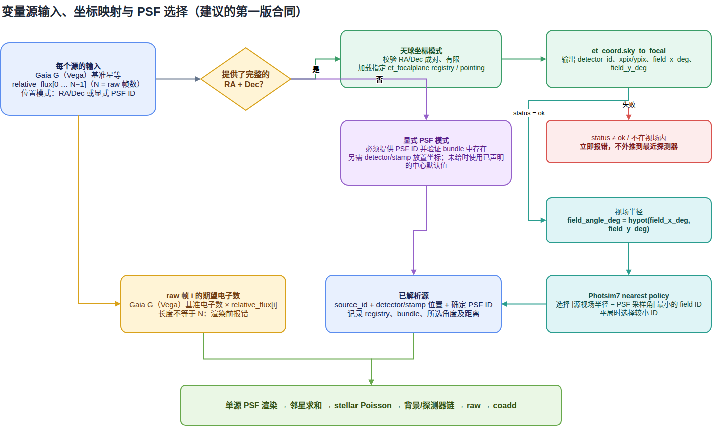
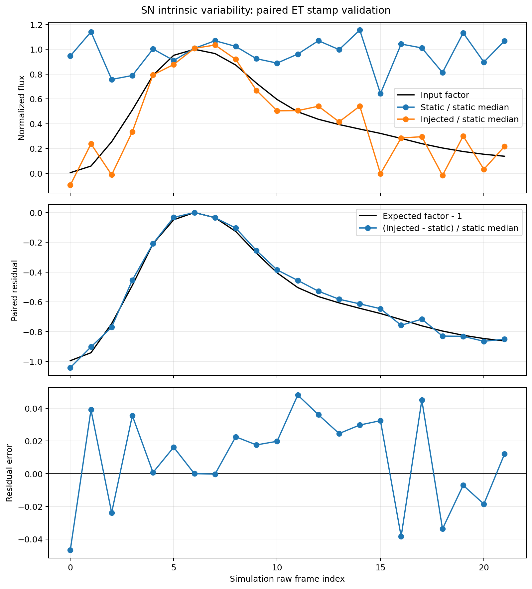

# 源内禀光变注入：科学团队输入说明

本文档定义 ET stamp 仿真第一版源内禀光变输入契约。目标是让科学团队提供的“源本身随时间变化”在进入探测器效应前，沿现有的星等、PSF、泊松噪声、读出和 coadd 链路完成可复现仿真。

这里的 ECSV/CSV contract 是通用 table-mode 输入。银河系团队最新的 FITS 已有一条
单独的、正式可生产 profile：它保留输入曲线的相对节点间隔、去除绝对 epoch 后做
10 s 曝光平均，并冻结为 `q(t)=1+DeltaF/F_ref` snapshot。其正式执行和交付语义见
[galaxy_independent_stamp_production_zh.md](galaxy_independent_stamp_production_zh.md)
与 [galaxy_raw_coverage_science_delivery_zh.md](galaxy_raw_coverage_science_delivery_zh.md)。

第一版只接收 **Gaia G Vega 基准星等**与无量纲相对流量。通用 ECSV
table-mode 要求数据提供方先把曲线转换成仿真 raw frame 序列；其物理时间不会被
读取、插值或换算。Galaxy FITS formal profile 则保留其相对采样间隔、丢弃绝对
epoch，并在仿真时间轴上执行曝光平均，详见后文。

## 1. 最小交付物

每次交付建议包含以下四项：

```text
delivery/
  targets.ecsv              # 源、基准星等和位置/PSF
  variability.ecsv          # 可选；逐 raw frame 的内禀光变
  README.md                 # 数据来源、波段、星等制、归一化和处理说明
  checksums.sha256          # 所有交付文件的 SHA-256
```

可以使用 CSV，但推荐 ECSV，因为 ECSV 能保留单位和 `Table.meta`。ET-mainsim 会把 JSON 可表示的 ECSV metadata 写入运行 provenance。

如果没有内禀光变，只交付 `targets.ecsv`，并且不要填写 `curve_id`。这条路径就是静态源基线。

## 2. 目标表 `targets.ecsv`

每一行是一个独立的单源 stamp 场景。当前 table 模式不自动加入邻星。列名不区分大小写，下面使用推荐的标准名称。

| 列 | 类型/单位 | 必需 | 含义 |
|---|---|---:|---|
| `source_id` | 非负整数 | 否 | 源的稳定唯一 ID；省略时使用行号 |
| `gaia_g_mag` | 有限浮点，mag | 是 | 静态基准亮度；第一版必须按 Gaia G Vega 解释 |
| `curve_id` | 非空字符串 | 否 | 关联到光变表；空值表示静态源 |
| `ra_deg` | 浮点，deg | 条件必需 | ICRS/J2000 赤经，必须与 `dec_deg` 成对出现 |
| `dec_deg` | 浮点，deg | 条件必需 | ICRS/J2000 赤纬，必须与 `ra_deg` 成对出现 |
| `psf_id` | 非负整数 | 条件必需 | 无天球坐标时必须显式给出 |
| `detector_xpix` | 浮点，pixel | 否 | 无天球坐标时可选，必须与 Y 成对出现 |
| `detector_ypix` | 浮点，pixel | 否 | 无天球坐标时可选，必须与 X 成对出现 |

位置有且只有两种合法模式：

1. **天球坐标模式**：填写 `ra_deg` 和 `dec_deg`，不要填写 `psf_id` 或 detector pixel。ET-mainsim 使用固定 transit 的 ET focal-plane registry 将 ICRS/J2000 映射到 detector、pixel 和视场角；映射到其他 detector 或落在视场外时直接失败。随后按视场角半径选择最近的可用 PSF 节点。
2. **显式 PSF 模式**：不填写 RA/Dec，必须填写 `psf_id`。detector X/Y 可以成对填写；两者都省略时，源放在配置 detector 的物理中心。请求的 PSF ID 在 bundle 中不存在时直接失败。

同一张表可以混合这两种行，但每一行内部不能混用。坐标模式需要运行环境安装 `et-coord`，并通过 `--focalplane-registry` 或 `ET_FOCALPLANE_ROOT` 指向固定 transit registry。

### 2.1 示例：由天球坐标自动选择 PSF

```csv
source_id,gaia_g_mag,curve_id,ra_deg,dec_deg
9000001,16.58910988417055,sn_ia_z0p03,304.41406499712303,51.81987707392268
```

### 2.2 示例：无天球坐标，显式指定 PSF

```csv
source_id,gaia_g_mag,curve_id,psf_id,detector_xpix,detector_ypix
9000002,17.2,rrlyrae_001,4,4450.0,4560.0
9000003,15.8,,4,,
```

第二行是静态源；空 pixel 会使用 detector 中心。对于 CSV，建议完全省略不使用的坐标列，避免不同读取器对空值类型的处理差异。

## 3. 光变表 `variability.ecsv`

光变表采用 long format，三列均为必需：

| 列 | 类型/单位 | 含义 |
|---|---|---|
| `curve_id` | 非空字符串 | 曲线 ID，可被多个目标复用 |
| `frame_index` | 非负整数 | 仿真 raw frame，从 0 开始 |
| `relative_flux` | 有限且 `>= 0` 的浮点 | 相对基准源流量的无量纲乘数 |

对每一条曲线，如果本次仿真有 `N` 个 raw frame，就必须恰好提供一次 `0, 1, ..., N-1`：不能缺帧、重复、越界或使用浮点 frame index。表中没有被目标引用的曲线允许存在，但仍会完整校验，并在 provenance 中记录为 unreferenced。

```csv
curve_id,frame_index,relative_flux
sn_ia_z0p03,0,0.00451011
sn_ia_z0p03,1,0.05786448
sn_ia_z0p03,2,0.25377219
```

`relative_flux=1` 表示与 `gaia_g_mag` 对应的基准亮度相同，`0` 表示该帧没有该源的恒星光子。大于 1 的值合法。该值描述 clean intrinsic variability，不应预先叠加测量噪声、天空背景、泊松噪声或读出噪声。

### 3.1 从绝对星等曲线转换

若团队提供每帧 Gaia G Vega 星等 `m_i`，先明确一个基准星等 `m_ref`，把它写入目标表的 `gaia_g_mag`，再计算：

```text
relative_flux_i = 10 ** [-0.4 * (m_i - m_ref)]
```

反向关系为：

```text
m_i = m_ref - 2.5 * log10(relative_flux_i)
```

必须在 README 中说明 `m_ref` 的选择，例如峰值、静态宿主亮度或某个物理参考历元。不要同时把每帧绝对亮度写进 `gaia_g_mag` 又把同一变化写进 `relative_flux`，否则会重复计算光变。

### 3.2 时间对齐规则

通用 ECSV table-mode 只读取 `frame_index`。即使表里存在 `time`、`observer_time`、MJD 或 phase 列，它们也会被忽略并记录在 provenance 的 ignored time columns 中。Galaxy
FITS formal profile 是唯一例外：它不使用绝对 epoch，但会把有限节点之间的相对间隔
用于构造分段线性 clean curve，并计算每个仿真曝光的精确平均 `q(t)`。

科学团队需要在交付前决定如何把物理曲线映射到仿真帧：

- 选择仿真起点对应的物理相位；
- 按 raw cadence 重采样或插值；
- 明确曝光内采用瞬时值、曝光平均值还是积分值；
- 输出恰好 `N` 个 `relative_flux`。

这项设计保证“第 i 行时间”不会被误当成秒、天或 MJD，但也意味着当前版本不会替科学团队做时标换算。

## 4. 光变如何进入仿真链路



对每个源和 raw frame，Photsim7 先用 `gaia_g_mag` 走既有的 Gaia G 到基准光子/电子数转换，再乘以 `relative_flux`：

```text
baseline source electrons
        × relative_flux(frame)
        ↓
PSF 投影与所有源求和
        ↓
stellar Poisson sampling
        ↓
背景、宇宙线、读出、增益/数字化
        ↓
raw stamp → detector-domain coadd
```

因此，内禀光变发生在 PSF 场景渲染和恒星泊松抽样之前。这样做的物理含义是：源变亮时，期望光子数和相应散粒噪声一起增加；源变暗时两者一起减少。背景、宇宙线、读出噪声等仍由原 stamp 链路独立产生。

核心数值关系是：

```text
effective_photon_count_electron
  = baseline_photon_count_electron * relative_flux
```

没有 `curve_id` 时使用全 1 因子，并保持原静态仿真的随机数路径不变。coadd 不会先平均光变；它逐个 raw frame 注入、逐帧模拟后再求和。

## 5. 运行方式

```bash
et-mainsim run et-stamp \
  --preset production \
  --input-table targets.ecsv \
  --variability-table variability.ecsv \
  --focalplane-registry /path/to/et_focalplane \
  --output-root /path/to/results \
  --run-id science-team-run-001
```

配置文件中对应字段是：

```toml
[workload]
input_mode = "table"
input_table = "/path/to/targets.ecsv"
variability_table = "/path/to/variability.ecsv"
include_neighbors = false
```

`variability_table` 只允许用于 table mode。为了让静态和注入对照共享随机数，应使用相同的 `run_id`、seed、SimulationSpec、目标、位置、PSF 和 stamp 参数，只把结果写到不同的 `output_root`。

## 6. 输出、truth 与可复现性

每个目标目录除原有 raw/coadd 产品外，还包含：

```text
stamps/target_<source_id>/
  raw.h5
  coadd.h5
  source_variability_truth.ecsv
  target_artifacts.json
  schemas/raw/frame_NNNNNN.json
  schemas/coadd/coadd_NNNNNN.json
  electron_components/frame_NNNNNN.npz  # 按需开启
```

`source_variability_truth.ecsv` 逐帧保存实际使用的 `relative_flux`、baseline/effective photon count、source ID、curve ID 和运行时 PSF ID。目标表、光变表以及坐标模式使用的 focal-plane registry 都有内容身份记录；普通文件记录 resolved path、byte size 和 SHA-256。

`target_artifacts.json` 保存 truth 文件身份。resume 会重新读取 truth，检查 frame/source 完整性、有限非负、`effective = baseline * factor`，并复核 digest。输入或 truth 漂移会失败关闭，不会静默复用旧结果。

raw/coadd HDF5 provenance 和逐帧 schema 还会保存：

- Gaia G Vega 输入语义；
- 天球坐标到 detector/pixel/视场角的解析结果；
- PSF bundle、选择策略、节点角距离；
- curve ID、时间对齐策略和 ECSV metadata；
- 目标表、光变表和 registry 身份。

## 7. 科学团队交付前检查表

- `gaia_g_mag` 是否明确为 Gaia G Vega？
- 波段透过率是否真的是项目采用的 Gaia G 定义，而不是未说明的裁剪近似？
- `relative_flux` 是否是 clean intrinsic signal，而不是带测量噪声的观测量？
- 是否说明了基准星等和归一化公式？
- 每条曲线是否恰好覆盖本次仿真的全部 raw frame？
- 是否已经按仿真 cadence 对齐，而不是依赖输入时间列？
- 是否给出 RA/Dec，或在没有坐标时给出有效 `psf_id`？
- RA/Dec 是否为 ICRS/J2000，并确认目标属于本次配置 detector？
- 是否提供列字典、单位、版本、生成代码/模型和 SHA-256？
- ECSV/CSV 中是否没有 NaN、Inf、重复 frame 或负 relative flux？

## 8. 当前 SN 团队数据评估

已检查 `SN_gaiaG_redshift_grid.zip` 中的 9 条超新星曲线。它们适合做工程链路验证，但还不能直接作为正式科学输入。

### 8.1 可以复用的内容

- 每条 CSV 有 `mag_clean`，可作为 clean intrinsic magnitude；
- 类型、红移、生成模型和距离标定有 README 说明；
- 数据有限、无空值，能转换成 `relative_flux`；
- 单曲线表便于构造短时注入 smoke test。

### 8.2 需要解决的问题

1. **星等制不符。** 文件明确使用 AB (`zpsys=ab`)，第一版接口要求 Gaia G Vega。正式数据必须由团队完成 AB→Vega 的波段一致转换。本次验证只把 AB 数值暂时当作 Vega 数值直接输入，属于工程代理，不能用于科学结论。
2. **波段被裁剪。** 输入使用 `gaia_g_3260_9290`，README 说明原始 Gaia G 约延伸到 10500 Å。裁剪会改变零点、颜色项和不同 SN SED 下的有效星等，需要科学团队确认该带宽是否可代表项目的 Gaia G。
3. **时间采样与 ET cadence 不同。** CSV 每点间隔约数天，ET raw cadence 是秒级。当前接口按行对应 raw frame，并忽略 `time`/`observer_time`；直接逐行注入会把数十天演化压缩成数分钟。正式交付必须先定义物理相位和重采样方法。
4. **没有 frame-aligned 格式。** 现有列是 `time`、`observer_time` 和测光量，没有 `curve_id, frame_index, relative_flux`，且 9 条曲线行数不同。
5. **基准定义不够。** 需要明确目标表 `gaia_g_mag` 代表峰值、某个参考历元还是宿主+瞬变总亮度，以及光变是否包含静态宿主。
6. **clean 与 noisy 列并存。** `mag`、`flux`、`fluxerr`、`magerr` 含模拟测量噪声或任意零点；内禀注入应使用 `mag_clean`。当前接口也不传播这些测量误差。
7. **没有空间/PSF 信息。** 文件没有 RA/Dec、detector pixel 或 PSF ID，无法决定目标所在 detector 和 PSF。正式交付必须另给目标表。
8. **缺少机器可读单位与版本身份。** CSV 本身没有 ECSV units/meta，也没有 checksums 清单。建议把模型、波段、星等制、参考星等、重采样规则和源文件版本写入 ECSV metadata 与 README。

本次工程验证采用 `z0p03_Ia_GaiaG_simulated_photometry.csv` 的前 22 行：

- 原文件 SHA-256 为 `fb11b6454c7df58bab15f154091b2b6871c78d91d085adda5dbc73ca1431e2b4`；
- `m_ref = min(mag_clean) = 16.58910988417055`；
- `relative_flux = 10**[-0.4*(mag_clean-m_ref)]`；
- 忽略 `time` 和 `observer_time`；
- 原始 AB 数值按 Gaia G Vega 语义输入；
- 使用相同 seed/run ID 分别跑静态与注入链路，并比较配对测光残差。

原文件共有 23 行；短测只取前 22 行是为了让 2 raw/coadd 整除，最后一行并非因科学质量被剔除。这个选择和 omitted row count 都写入了 ECSV metadata。

### 8.3 工程验证结果



| 指标 | 结果 | 解释 |
|---|---:|---|
| `stellar_mean` ratio 最大绝对误差 | `5.98e-08` | 泊松抽样前的期望恒星信号与输入因子数值一致 |
| 最终 DN 配对残差 Pearson r | `0.9963` | 注入—静态差分追踪 `relative_flux - 1` |
| 最终 DN 配对残差拟合斜率 | `1.0197` | 在完整噪声链路中接近单位响应 |
| 最终 DN 配对残差 RMSE | `0.0289` | 22 帧短测中的归一化残差散布 |
| NaN / 饱和 pixel | `0 / 0` | 本次短测没有无效值或饱和 |

正式结果来自 H100 节点上的 Slurm CPU job `202705`，使用 `etbase-clu`、ET-mainsim commit `92594c3` 和 Photsim7 commit `308913a`，运行时间 6 分 44 秒。其结果 PNG 与本机 `etbase` 对照的 SHA-256 都是 `60c0ede6ac349ee846a260d3c57b9fdf68e6643be3977c11337bdc5cd6568af8`，说明两套环境得到相同结果。

第一幅图保留了静态 control 的逐帧噪声，所以 injected 单独看并不会严格落在输入曲线上；第二幅图使用同 run ID/seed 的 `(injected - static) / median(static)` 配对残差，背景、读出等共同随机分量大幅抵消，能直接检验注入响应；第三幅图显示剩余误差。无噪声 `stellar_mean` 的误差远小于 `1e-4`，说明源光变确实在恒星泊松抽样前生效，而不是对最终图像做后处理缩放。

机器可读结果见 [metrics JSON](assets/source-variability-validation-metrics.json) 与 [逐帧 CSV](assets/source-variability-validation-per-frame.csv)。

仓库中的 `scripts/validate_source_variability_stamp.py` 会从 production spec 派生 22 raw frame、220 s、2 raw/coadd 的短时 spec，并自动运行相同链路的静态/注入两组；不要只对 production preset 加 `--frames 22`，因为原 preset 的 30 raw/coadd 与 22 不整除。

## 9. 当前银河系考古团队 FITS 评估

最新提交的 `mock_lightcurves_sourceid.fits` 已替代此前误提交的百度网盘安装镜像，
可以用于正式 independent stamp 生产。文件含 74 个源，并给出：

- Gaia source ID (`Source`)；
- Gaia G 星等 (`Gmag`)；
- ICRS/J2000 坐标 (`RAJ2000`, `DEJ2000`)；
- 源类别 (`class`)；
- 内禀 `relative_flux = Delta F / F_ref` 和相对时间节点 (`time`)。

正式读取器将 `q=1+relative_flux`，删除尾部 NaN padding，忽略绝对时间零点，并对
每个 10 s raw exposure 做 piecewise-linear 区间平均。所有当前 74 条曲线约覆盖
1461 天，足以支持 90 天生产；10 个默认正式目标均可映射到 ET focal plane。

仍应随每次科学更新明确以下版本信息：Gaia G 是否为 Vega、`relative_flux` 的基准
定义、clean/noisy 列选择、曲线生成版本和 SHA-256。若将来加入没有 RA/Dec 的新源，
团队必须给出明确 PSF ID；不能由生产者猜测位置。

## 10. 第一版明确不做的事情

- 不自动解释或重采样物理时间；
- 不直接接收每帧 magnitude 作为运行时输入；
- 不注入 `magerr`/`fluxerr`，也不生成随机内禀过程；
- 不支持随帧移动的天球坐标；
- 不在 PSF 节点间插值，只选最近的径向视场角节点；
- 不把 table-mode 单源场景自动扩展为邻星场；
- 不把 AB 数值等同 Vega 作为长期科学规则。

这些限制让第一版输入、物理顺序、随机数和 truth 都能被严格验证。后续若需要原生时间轴、波段转换、PSF 插值、宿主+瞬变分解或多源联合光变，应在新 schema version 中显式扩展。
