# 源内禀光变注入：30 天 stamp 科学快看

本文记录 SN、银河系考古和星震三个团队各一颗亮源的 30 天端到端 stamp
快看。目标不是给出最终科学测光指标，而是验证团队光变能否在统一输入契约下，
于恒星泊松抽样之前进入 Photsim7，并经过现有 PSF、动态效应、探测器噪声、
ADC 和 `6 × 10 s → 1 min` coadd 链路形成可审计的图像与光变产物。

## 1. 结论摘要

- 三个场景均按 30 d、10 s raw cadence、每 6 帧合成 1 min 运行；每个场景
  包含 259,200 个 raw truth 和 43,200 个 coadd。
- 每颗源分别运行静态基线和内禀光变注入，共 6 个逻辑运行。每个逻辑运行
  再拆成 6 个全局时间分片，分片合并后严格覆盖全部全局 frame/coadd ID。
- 静态与注入对照共享相同逻辑 `run_id`、SimulationSpec、源、位置、PSF、
  run seed 和全局 frame ID；两路只在是否提供 variability table 上不同。
- SN 的大振幅演化可直接从单次注入运行恢复；Galaxy 与 Aster 的千 ppm 量级
  信号在单次 fixed-aperture 快看中会受到公共动态/通量调制影响，配对差分则用于
  单独验证注入响应。**配对指标不是单次科学测光精度。**
- 本轮孔径由分析 notebook 根据静态确定性参考图像构造，是工程 QA，不是
  production simulator 当前直接交付的 Kepler OA 产品。

## 2. 输入与临时假设

| 团队 | 选源与基准亮度 | 位置/PSF | 30 d 光变转换 | 本轮必须保留的限制 |
|---|---|---|---|---|
| SN | Type II-P，`z=0.01`；合成 ID `2001000000001`；数值 G=16.2758577466 | 无坐标；显式 PSF 6（12°） | 仿真 `t=0` 锚定 rest phase −8 d；含 `(1+z)` 时间膨胀；在相对流量空间分段线性并计算每个 10 s 曝光的精确平均 | 团队文件是 Gaia G AB；本轮按已确认的临时策略，仅把 AB 数值当 Vega 数值，未做零点换算 |
| Galaxy | Gaia DR3 `2100787084231447424`；G=11.279311 | RA/Dec 自动映射到唯一 `main_ld`，最近 PSF 5（10°）；不复制成四份 detector workload | 团队已确认 `delta F/F_ref` 对应 G；采用 `q=1+delta F/F_ref`；120 s 节点分段线性并计算 10 s 曝光平均；绝对时间丢弃 | 仍需正式 README 固化坐标 frame/epoch、Gaia release、曲线是否为 clean intrinsic signal，以及四年窗口/循环规则 |
| Aster | PSLS `0000000622`；合成 ID `9000000000000000622`；快看 G=11.5 | 无坐标/Gaia ID；显式 PSF 6（12°） | 原生 10 s；`q=1+ppm×10⁻⁶`，不插值；绝对时间偏移丢弃 | 团队原始 G=6 在 10 s/PSF 6 下严重超过 90,680 e⁻ 满阱；G=11.5 仅为保持快看可解释性的临时重标定 |

输入峰峰值分别约为：SN 834,439 ppm、Galaxy 2,067 ppm、Aster 2,354 ppm。
所有运行只把 `frame_index` 作为时间键；原始文件的绝对时间不会传入仿真器。

## 3. 注入与 coadd 链路

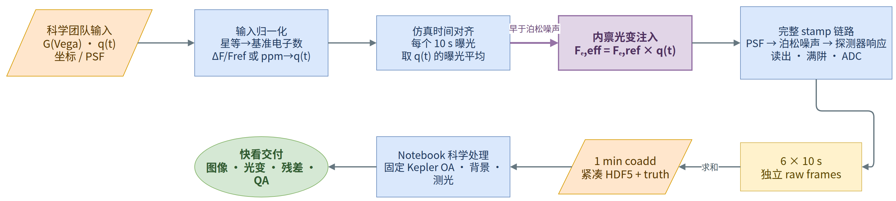

每个 10 s raw frame 的核心关系为：

```text
baseline source electrons from Gaia G Vega
        × relative_flux(global raw frame)
        ↓
PSF projection and source composition
        ↓
stellar Poisson sampling
        ↓
background / cosmic ray / readout / gain / ADC
        ↓
six independently simulated raw DN stamps summed into one 1 min coadd
```

所以源变亮或变暗时，期望恒星电子数和对应散粒噪声会一起改变。对于 SN 的
“3-day 时标”问题，本轮不是把每个三天节点简单复制到 10 s：外部预处理先在
物理相位上建立分段线性相对流量模型，再计算每个 10 s 曝光区间内的平均因子；
Galaxy 的 120 s 节点同样采用曝光平均。Aster 本身已经是 10 s cadence，因此直接
逐帧对齐。

## 4. 正式运行配置与可扩展性

| 项 | 值 |
|---|---:|
| 仿真时长 | 30 d |
| raw 曝光 | 10 s |
| raw frame / 场景 | 259,200 |
| coadd | 6 × 10 s → 1 min，逐 raw 完整模拟后求和 |
| coadd / 场景 | 43,200 |
| 时间分片 | 6，按全局 coadd ID 模 6 选择 |
| artifact profile | `compact` |
| HDF5 write batch | 32 items |
| raw 图像 | 不保存；raw truth 仍完整保存 |
| 运行 seed | 20260714 |
| 执行资源 | 本地 2 × RTX 5090；GPU 0 跑 static，GPU 1 跑 injected；每路 6 个独立时间分片进程 |

`compact` profile 保留 HDF5、manifest、source-variability truth 和输入/运行
provenance，但省略逐帧 JSON sidecar。HDF5 批写采用
`WRITING → payload flush → COMPLETE flush` 两阶段提交；中断项可恢复重算。
分片使用同一完整 SimulationSpec 和全局时间轴，不会把 30 d 缩短为 5 d，也不会
在每个分片重新从 frame 0 开始。

正式结果冻结在 ET-mainsim `24af81f` 与 Photsim7 `30b86e5`。其后的分支提交只修复
大整数 ID 校验、紧凑 provenance 和批写崩溃恢复测试，没有改变本轮所用的光变、
PSF 或 detector 物理链路；因此没有为了 metadata 修正重新消耗 30 d 仿真。

## 5. QA 方法

每个团队目录中的 notebook 执行以下检查：

1. 合并 6 个分片后，coadd ID 必须严格且唯一覆盖 `0..43199`；raw truth ID
   必须严格且唯一覆盖 `0..259199`。
2. HDF5 状态必须全部为 `COMPLETE`；静态/注入的 SimulationSpec、workload、
   source、全局 ID 和 seed vector 必须一致。
3. truth 必须逐帧满足
   `effective_photon_count = baseline_photon_count × relative_flux`。
4. 静态确定性参考图像只使用最多 4,096 个样本构造分析侧 Kepler-style
   cumulative-SNR 孔径，之后冻结同一 mask 用于静态和注入两路。
5. 同时输出 1 min 光变和 1 h median 光变。后者共有 720 个 bin，用于报告中的
   长时趋势指标。
6. 所有 HDF5、truth 和 manifest 路径、大小、SHA-256 与 RNG 契约均写入
   `quicklook_metrics.json`，notebook 必须无 error cell。

HDF5 的 seed 向量在当前格式中重复记录 run seed `20260714`，它不是逐帧 child
seed。实际 child random stream 由共享 run identity、SimulationSpec、source 和
global frame ID 派生；配对 QA 同时检查这些完整身份，不能只比较这一列整数。

这里报告两个互补量：

- **injected-only**：仅从有注入运行提取，反映这次 fixed-aperture 工程快看在公共
  动态和噪声存在时对输入的直接恢复；
- **paired**：有注入减去无注入的共随机数对照，再加回单位基线，用于隔离并检验
  注入模块的线性响应。它会抵消公共动态/噪声，不能当作单次科学测光性能。

## 6. 30 天快看结果

以下均为 1 h median 指标；输入峰峰值也按 1 h 图所对应的 1 min coadd truth 范围
统计。`injected RMS` 是单次注入光变相对 truth 的残差 RMS；`paired robust σ`
仅用于共随机数注入 QA。

| 源 | 1 min 输入峰峰值 | 分析孔径 | injected-only `r` | injected slope | injected RMS | paired `r` | paired slope | paired robust σ |
|---|---:|---:|---:|---:|---:|---:|---:|---:|
| SN | 834,405 ppm | 9 px | 0.999791 | 1.001349 | 3,716.69 ppm | 0.999975 | 1.000073 | 969.89 ppm |
| Galaxy | 2,045 ppm | 42 px | 0.108297 | 1.184536 | 1,903.80 ppm | 0.999035 | 0.994656 | 4.98 ppm |
| Aster | 2,352 ppm | 42 px | 0.175722 | 1.051660 | 1,503.84 ppm | 0.999374 | 0.998720 | 6.57 ppm |

### 6.1 SN：大振幅演化直接可见

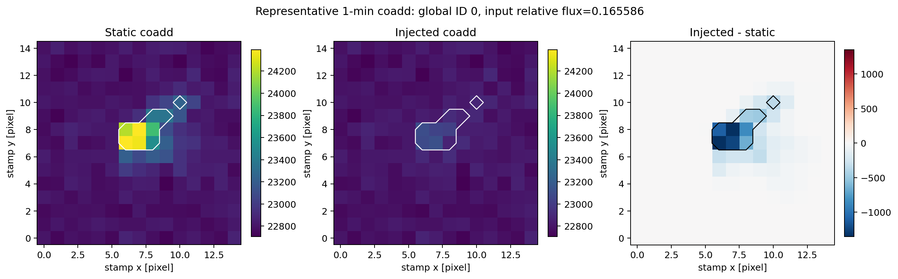

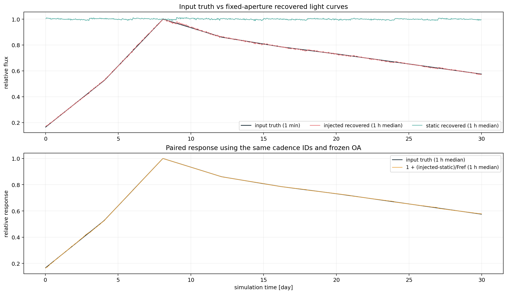

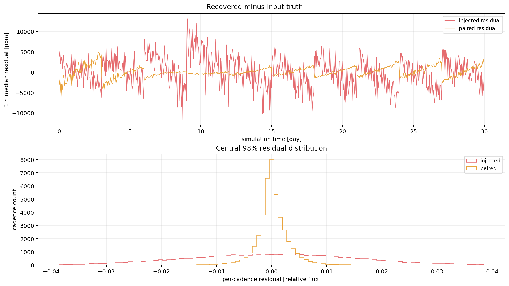

SN 在 30 d 内从参考峰值的约 0.166 演化到约 1.000。1 h 注入单路与 truth 的
相关系数为 0.999791、响应斜率为 1.001349；配对响应相关系数为 0.999975、斜率
为 1.000073。结果说明大振幅的物理趋势经过完整 detector-domain 链路后仍清晰可见。

### 6.2 Galaxy：微弱信号需要区分单路性能与模块验证

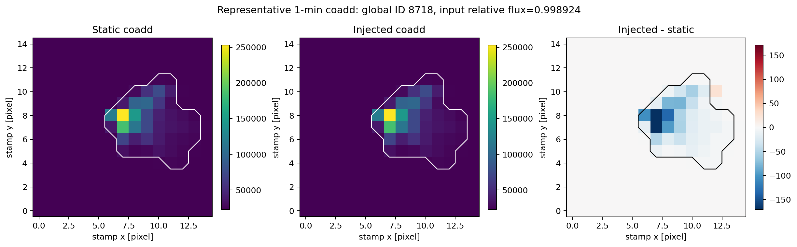

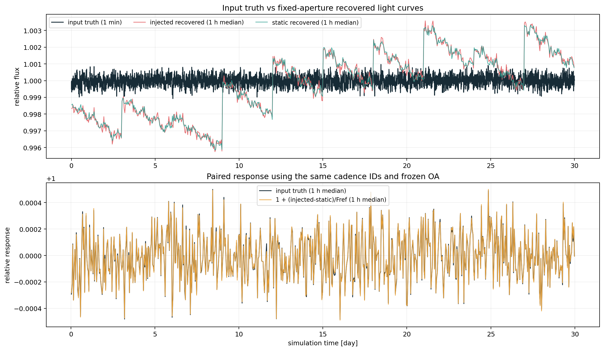

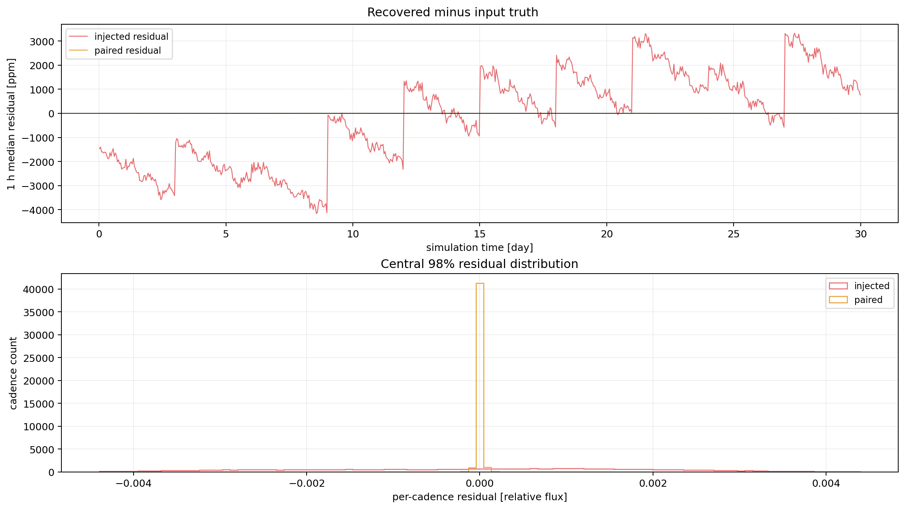

Galaxy 输入只有约 2,067 ppm 峰峰值。1 h 注入单路相关系数为 0.1083，说明当前
fixed-aperture 快看中的公共动态/通量调制已大于这条内禀变化；图中约三天尺度的
共同结构来自动量卸载、PSF breathing、指向/PSF 运动等完整链路效应。共随机数
配对后，相关系数为 0.999035、斜率为 0.994656、robust residual 为 4.98 ppm，
验证的是“注入模块按给定 `q` 正确响应”，而不是宣称单次观测已有 5 ppm 精度。

### 6.3 Aster：千 ppm 星震输入

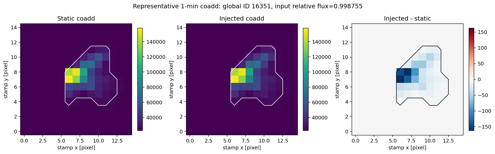

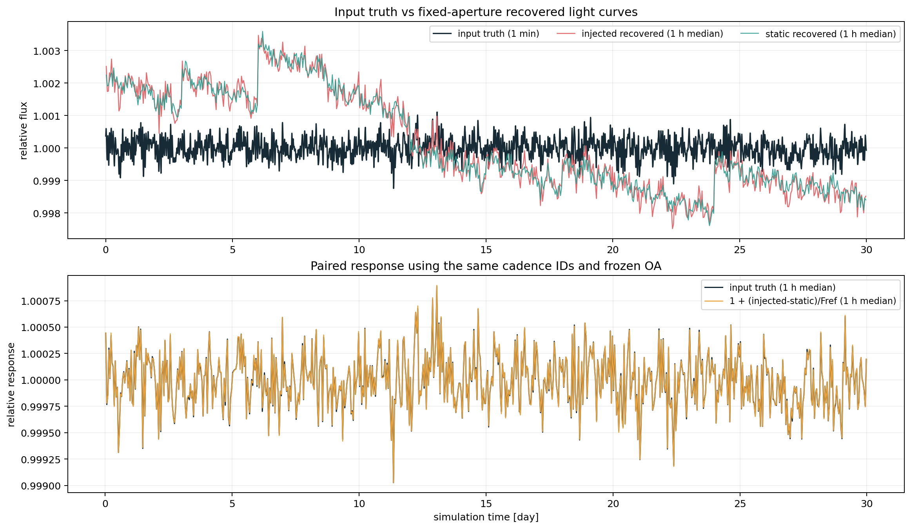

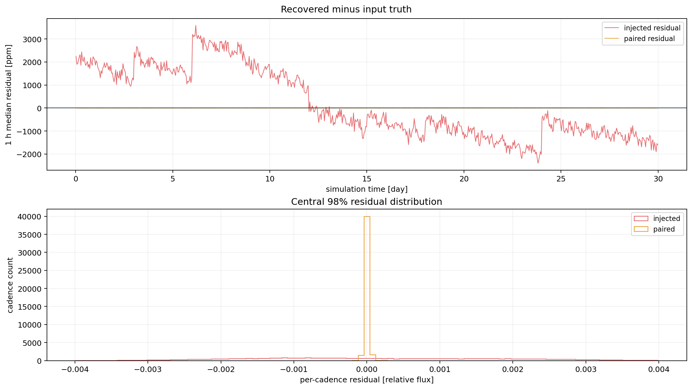

Aster 输入约 2,352 ppm 峰峰值，与 Galaxy 同属弱信号。1 h 注入单路相关系数为
0.175722、响应斜率为 1.051660，说明单次 fixed-aperture 快看仍被公共调制主导；
配对响应相关系数为 0.999374、斜率为 0.998720、robust residual 为 6.57 ppm，
验证 `q=1+ppm×10⁻⁶` 在原生 10 s cadence 下正确进入链路。这里同样不能把
6.57 ppm 解读为 G=11.5 单次星震测光精度。

### 6.4 三类信号横向比较

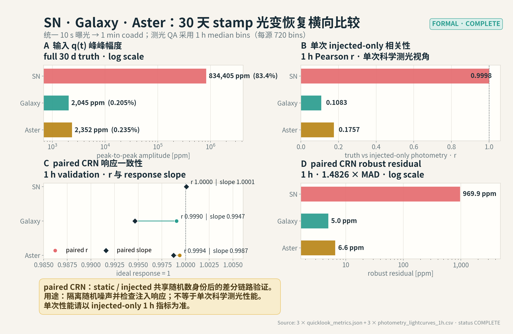

横向图把输入峰峰值、注入单路 1 h 相关系数、配对响应相关系数/斜率和配对
残差并列展示。它用于说明信号幅度与公共系统效应的相对关系；不同源亮度、PSF
和分析孔径不同，不能把这三个点解释成统一的仪器性能曲线。

## 7. 文件与交付

本轮 science-team 工作目录包含输入预处理脚本/notebook、严格执行后的分析
notebook、1 min 与 1 h 光变表、代表性 stamp、孔径、metrics 和图。正式仿真根目录为：

```text
/home/cxgao/Results/source_variability_quicklook/formal_30d/
  sn/{static,injected}/...
  galaxy/{static,injected}/...
  aster/{static,injected}/...
```

团队目录：

- SN：`/home/cxgao/ET/Nova/SN_gaiaG_redshift_grid_extracted/gaiaG_redshift_grid/`
- Galaxy：`/home/cxgao/ET/Galaxy/data-2/`
- Aster：`/home/cxgao/ET/Aster/lightcurves_test10/`

本 PR 附带可审阅的汇总图、metrics JSON 和最终中文 PPT。正式面向科学团队的
长期交付建议包含：

- [最终中文 PPT](assets/source-variability-quicklook-30d/source-variability-stamp-quicklook-30d.pptx)
- [SN metrics](assets/source-variability-quicklook-30d/sn-quicklook-metrics.json)、
  [Galaxy metrics](assets/source-variability-quicklook-30d/galaxy-quicklook-metrics.json)、
  [Aster metrics](assets/source-variability-quicklook-30d/aster-quicklook-metrics.json)

1. 目标表、逐 10 s exposure-average 光变表、README、SHA-256；
2. compact HDF5 1 min coadd 与完整 source-variability truth；
3. 代表性 stamp/必要的 raw 子样本，而不是默认保存 259,200 个 raw 图像；
4. 可执行 notebook，以及 1 min/1 h 快看光变、孔径定义、质量检查和 metrics；
5. manifest、SimulationSpec、输入身份、PSF/坐标解析、时间分片和 RNG provenance。

production stamp 当前还没有随图像直接交付正式 OA、背景估计、误差列、质心与
quality flags。本轮分析光变可用于链路快看和注入 QA；要成为最终科学测光产品，
仍需另行定义并实现这些产品契约。
